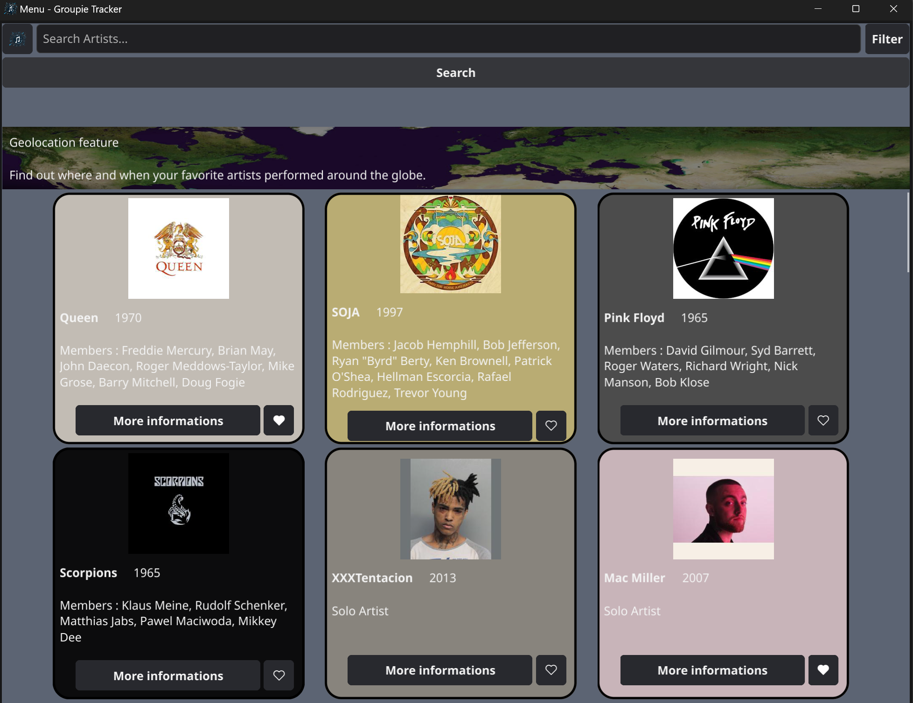

# Groupie Tracker

Groupie Tracker est une application développée en Go qui utilise une API pour afficher des informations sur des artistes et leurs concerts. L'objectif principal de cette application est de fournir une interface conviviale permettant aux utilisateurs de rechercher, filtrer et visualiser les données sur les artistes et leurs concerts de manière ergonomique.

## Fonctionnalités
R
- Affichage des informations sur les artistes, y compris les membres, les dates de début d'activité, les premiers albums, etc.
- Barre de recherche permettant de rechercher des artistes, des membres, des dates, etc.
- Filtres pour les artistes et les concerts basés sur la date de création, la date du premier album, le nombre de membres, etc.
- Visualisations des données telles que des graphiques, des cartes, des listes, etc.
- Système de favoris pour enregistrer les artistes ou les concerts préférés.

## Instructions
- Exécuter l'application en utilisant la commande `go run main.go`.
- Assurez-vous de ne pas redimensionner ou mettre l'application en mode plein écran pendant son utilisation. (Note : L'utilisation de `myWindow.SetFixedSize(true)` peut provoquer des dysfonctionnements dans l'application.)
- Utiliser l'interface utilisateur pour explorer les données sur les artistes et leurs concerts.
- Profiter des fonctionnalités de recherche, de filtrage et de visualisation pour découvrir de nouveaux artistes et concerts.
- Fonctionnalité :
	- **a/ [Recherche]** : Permet la recherche d'artistes uniquement.
	- **m/ [Recherche]** : Permet la recherche de membres uniquement.